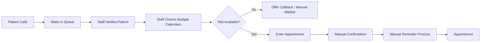
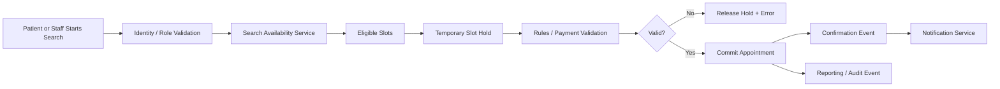

# As-Is / To-Be Process Analysis

## As-Is

---

## Current-State Issues

- Multiple manual handoffs
- Staff searches calendars sequentially
- No automated hold against concurrent booking
- Limited reminder automation
- Manual waitlist follow-up
- Weak auditability
- High dependency on call-center availability

---

## To-Be

---

## Expected Improvement

The future-state design reduces manual lookup, centralizes business rules, introduces transaction-safe slot holding, automates reminders, strengthens auditability, and provides a consistent workflow across patient and staff channels.

---

