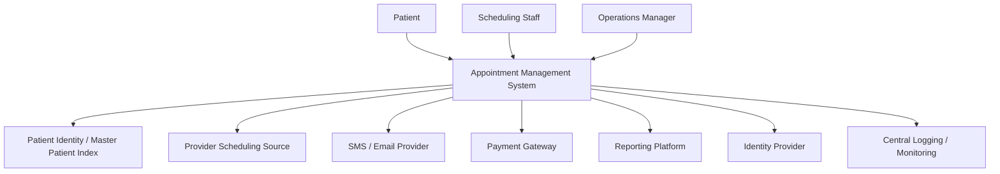

# System Context Diagram

## Context

---

## System Boundary

The Appointment Management System owns appointment search orchestration, temporary holds, booking state, waitlist state, rule enforcement, staff workflow, audit generation, and operational reporting extracts. Patient identity, provider-source data, outbound messaging transport, payment processing, and enterprise identity are external dependencies.

---

