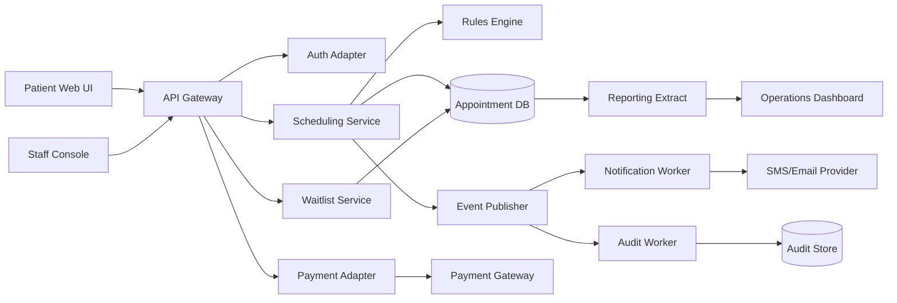

# Application Component Architecture

## Architecture

---

## Responsibilities

| Component | Responsibility |
|---|---|
| API Gateway | Request routing, throttling, correlation ID |
| Auth Adapter | Identity token validation and role claims |
| Scheduling Service | Search orchestration, slot holds, booking state |
| Rules Engine | Eligibility, cancellation, duplicate-service, override rules |
| Waitlist Service | Enrollment, ranking, offer lifecycle |
| Payment Adapter | Tokenized authorization requests and result handling |
| Event Publisher | Durable business-event publication |
| Notification Worker | Confirmation/reminder delivery and retry |
| Audit Worker | Immutable audit-event persistence |
| Reporting Extract | Curated operational KPI feed |

---

