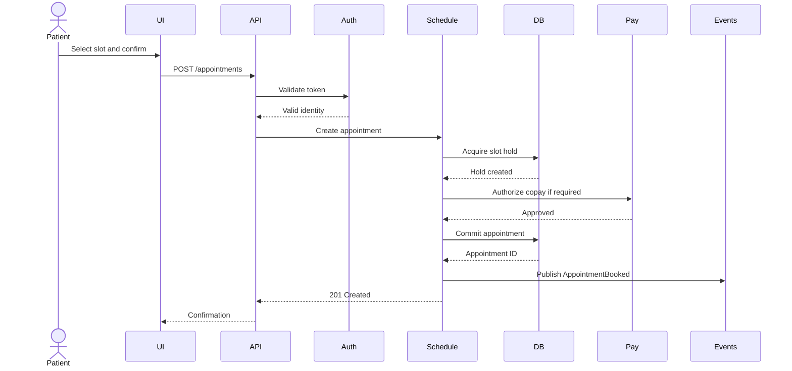
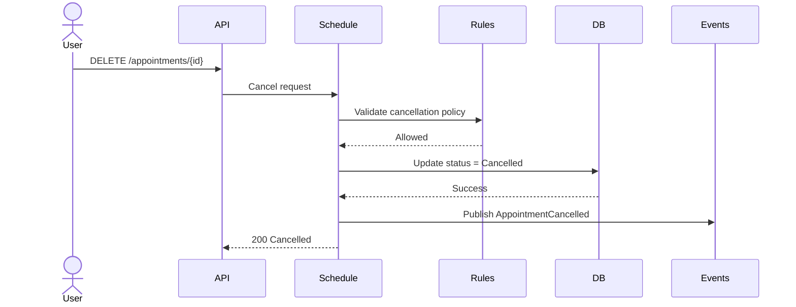

# Sequence Diagrams

## Book Appointment

```mermaid
sequenceDiagram
actor Patient
participant UI
participant API
participant Auth
participant Schedule
participant DB
participant Pay
participant Events
Patient->>UI: Select slot and confirm
UI->>API: POST /appointments
API->>Auth: Validate token
Auth-->>API: Valid identity
API->>Schedule: Create appointment
Schedule->>DB: Acquire slot hold
DB-->>Schedule: Hold created
Schedule->>Pay: Authorize copay if required
Pay-->>Schedule: Approved
Schedule->>DB: Commit appointment
DB-->>Schedule: Appointment ID
Schedule->>Events: Publish AppointmentBooked
Schedule-->>API: 201 Created
API-->>UI: Confirmation
```

---

## Cancel Appointment

```mermaid
sequenceDiagram
actor User
participant API
participant Schedule
participant Rules
participant DB
participant Events
User->>API: DELETE /appointments/{id}
API->>Schedule: Cancel request
Schedule->>Rules: Validate cancellation policy
Rules-->>Schedule: Allowed
Schedule->>DB: Update status = Cancelled
DB-->>Schedule: Success
Schedule->>Events: Publish AppointmentCancelled
Schedule-->>API: 200 Cancelled
```

---

