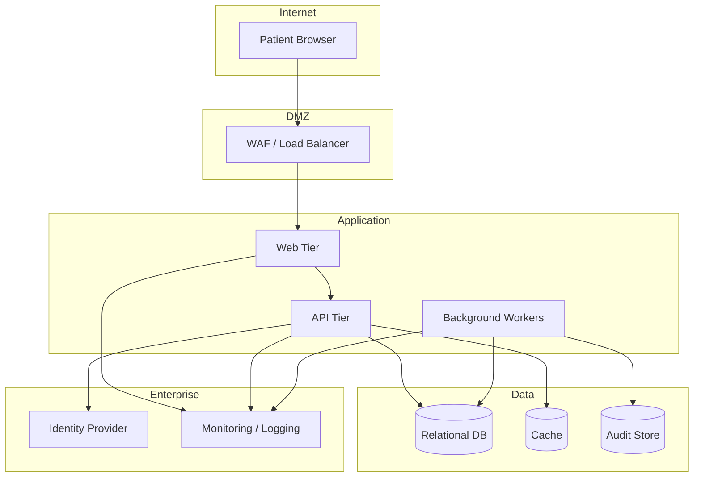

# Deployment & Environment Model

## Deployment

---

## Environments

| Environment | Purpose | Data | Deployment |
|---|---|---|---|
| Development | Developer integration | Synthetic | On demand |
| Test | System/integration testing | Synthetic | CI/CD |
| UAT | Business validation | Masked/synthetic | Controlled release candidate |
| Staging | Production-like readiness | Masked | Release pipeline |
| Production | Live operations | Production PHI | Approved pipeline with change record |

---

