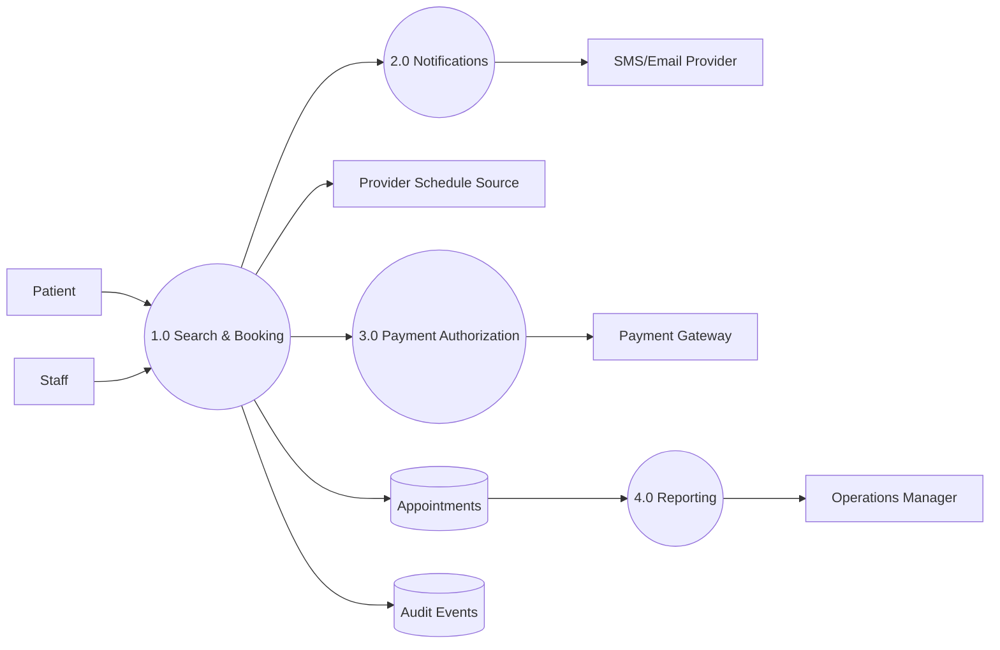
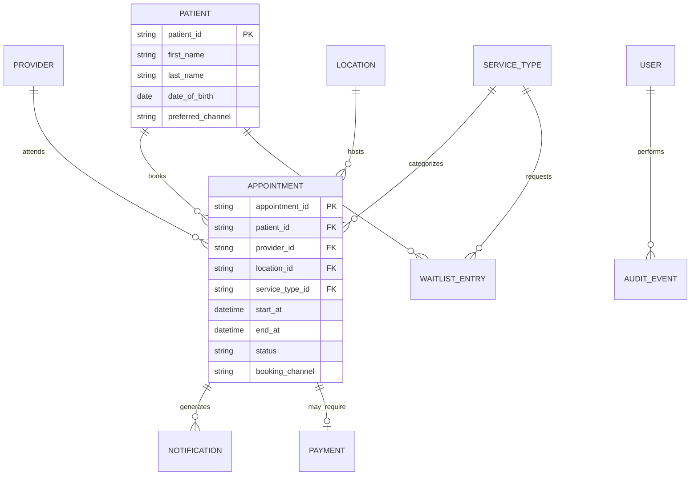

# Data Flow & Entity Relationship Model

## Level-1 Data Flow

```mermaid
flowchart LR
PAT[Patient] --> P1((1.0 Search & Booking))
STAFF[Staff] --> P1
P1 --> D1[(Appointments)]
P1 --> EXT1[Provider Schedule Source]
P1 --> P2((2.0 Notifications))
P2 --> EXT2[SMS/Email Provider]
P1 --> P3((3.0 Payment Authorization))
P3 --> EXT3[Payment Gateway]
P1 --> D2[(Audit Events)]
D1 --> P4((4.0 Reporting))
P4 --> MGR[Operations Manager]
```

---

## ERD

```mermaid
erDiagram
PATIENT ||--o{ APPOINTMENT : books
PROVIDER ||--o{ APPOINTMENT : attends
LOCATION ||--o{ APPOINTMENT : hosts
SERVICE_TYPE ||--o{ APPOINTMENT : categorizes
APPOINTMENT ||--o{ NOTIFICATION : generates
APPOINTMENT ||--o| PAYMENT : may_require
PATIENT ||--o{ WAITLIST_ENTRY : joins
SERVICE_TYPE ||--o{ WAITLIST_ENTRY : requests
USER ||--o{ AUDIT_EVENT : performs

PATIENT {
  string patient_id PK
  string first_name
  string last_name
  date date_of_birth
  string preferred_channel
}
APPOINTMENT {
  string appointment_id PK
  string patient_id FK
  string provider_id FK
  string location_id FK
  string service_type_id FK
  datetime start_at
  datetime end_at
  string status
  string booking_channel
}
```

---

