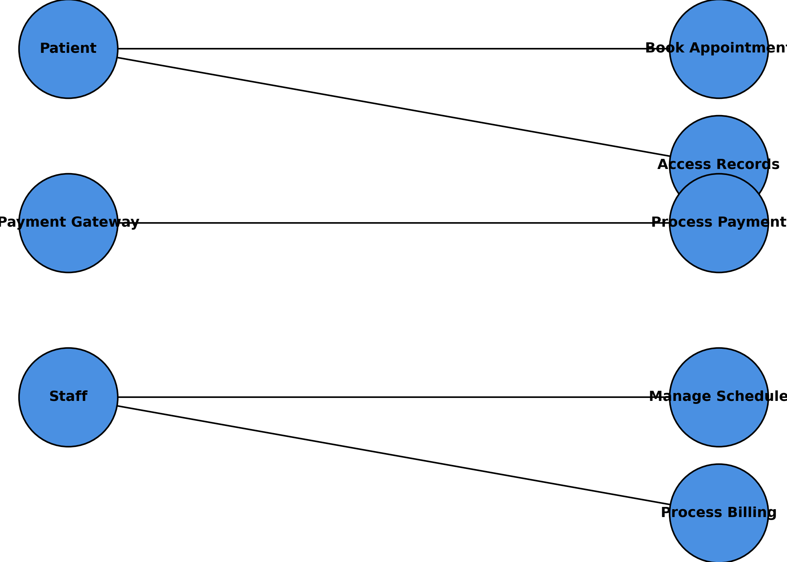
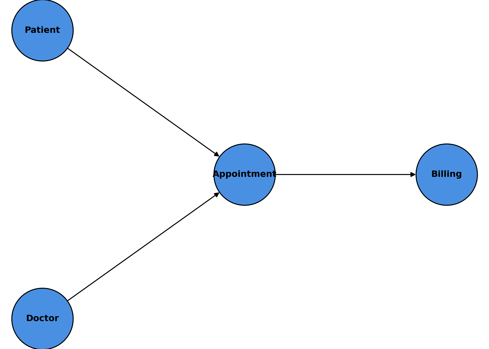

# 🖥️ Systems Analyst Portfolio — Jamie Christian  

  
  
  
  
  

---

## 📌 Overview  

This portfolio showcases **Systems Analysis & Business Analysis deliverables** across the project lifecycle.  
It demonstrates my ability to:  

- Translate business needs into **clear, testable requirements**  
- Model systems and processes (BPMN, UML, ERD, DFD)  
- Maintain traceability through RTMs, RACIs, and stakeholder maps  
- Drive UAT and QA for smooth delivery  
- Present insights via dashboards and reports  

---

## 🗂️ Featured Case Study  

### 📄 Healthcare Appointment System  
**Preview File:** `Healthcare_Appointment_Mini_Case_Study.pdf`  

**Problem:**  
Manual phone scheduling created delays, frequent errors, and lost revenue from no-shows.  

**Solution:**  
Delivered an **online appointment system** with self-service booking, reminders, payments, and secure access.  

**My Role (Systems Analyst / BA):**  
- Authored **BRD, FRS, NFR**  
- Built **BPMN As-Is / To-Be**, **DFDs**, **Use Case**, **ERD**  
- Defined integration points (Authentication, Notifications, Payments)  
- Created **RTM** for coverage & gap prevention  
- Led **UAT planning, test case design, defect log & sign-off**  

**Impact:**  
- Reduced booking errors by **~40%**  
- Decreased patient wait times by **~25%**  
- Cut no-shows by **~30%** via automated reminders  
- Improved staff scheduling efficiency by **20%**  

---

## 📷 Diagram Previews  

These diagrams illustrate how I analyze the **current state (As-Is)**, design the **future state (To-Be)**, and model both **user interactions** and **data structures**.  

### BPMN — Appointment Scheduling  
<table>
  <tr>
    <td align="center"> <em>BPMN — As-Is Appointment Scheduling Flow</em></td>
    <td align="center"> <em>BPMN — To-Be Appointment Scheduling Flow</em></td>
  </tr>
</table>  

---

### UML Use Case — Appointment System  
  
*Actors and system interactions for booking & records*  

---

### ERD — Appointment System  
  
*Entity Relationship Diagram — Core Data Model (Patients, Appointments, Payments)*  

👉 [View all diagrams here](./_Process_Models_Diagrams/)  

---

## ♻️ Reuse Templates  

This repo includes blank templates plus filled examples to guide quality.  

| Artifact        | Blank Template                  | Filled Example                           | Folder Location              |
|-----------------|---------------------------------|------------------------------------------|------------------------------|
| BRD             | BRD_Template.docx               | BRD_Healthcare_Appointment_System.docx   | **1_Requirements_Documentation** |
| FRS             | FRS_Template.docx               | FRS_Healthcare_Appointment_System.docx   | **1_Requirements_Documentation** |
| RTM             | RTM_Template.xlsx               | Requirements_Traceability_Matrix.xlsx    | **4_Traceability_Stakeholders** |
| RACI            | RACI_Template.xlsx              | RACI_Example.xlsx                        | **4_Traceability_Stakeholders** |
| Stakeholder Map | Stakeholder_Map_Template.docx   | Stakeholder_Map_Example.docx             | **4_Traceability_Stakeholders** |
| UAT Plan        | UAT_Plan_Template.docx          | UAT_Plan_Example.docx                    | **5_Testing_UAT** |
| UAT Cases       | UAT_Test_Cases_Template.xlsx    | UAT_Test_Cases_Example.xlsx              | **5_Testing_UAT** |
| UAT Feedback    | UAT_Feedback_Form_Template.docx | UAT_Feedback_Form_Filled.docx            | **5_Testing_UAT** |
| Defect Log      | Defect_Log_Template.xlsx        | Defect_Log_Example.xlsx                  | **5_Testing_UAT** |

---

### ✅ Quick Start (90-Second Checklist)  

1. **Download** the [`Templates-Starter.zip`](https://github.com/JamieChristian22/system-analyst-portfolio/releases) *(coming soon)* or **Fork** this repo.  
2. **Duplicate & rename** files:  
   `Artifact_<ProjectName>_vMAJOR.MINOR_YYYY-MM-DD.ext`  
   → Example: `BRD_PatientPortal_v1.0_2025-09-22.docx`  
3. **Keep folder names** consistent (see table above).  
4. **Export diagrams** (Lucidchart / draw.io) as PNG:  
   - Width: 1920px (or 2× scale)  
   - Background: Transparent **off**  
   - Padding: 16px  
5. **License:** MIT — free to reuse; attribution appreciated.  

💡 Suggested workflow → **BRD → FRS → RTM → Use Case + BPMN → UAT**  

---

## 📊 Artifact Categories  

- **Requirements Documentation**: BRD, FRS, NFR  
- **Modeling & Diagrams**: BPMN (As-Is/To-Be), UML Use Case, ERD, DFD  
- **Traceability & Stakeholder Mgmt**: RTM, RACI, Stakeholder Maps  
- **Testing & Quality**: UAT Plans, Test Cases, Feedback Forms, Defect Logs  
- **Governance & Data**: Risk Logs, Change Logs, Data Dictionary  
- **Reporting & Dashboards**: KPI Reports, Excel/PowerBI dashboards  

---

## 🛠️ Tools & Technologies  

- **Documentation & Modeling:** Lucidchart, draw.io, MS Visio, MS Word/Excel  
- **Data & Reporting:** Excel (Pivot, VLOOKUP, Dashboards), Power BI  
- **Systems & Platforms:** Salesforce (Sales Ops/Service Cloud), JIRA, Confluence  
- **Techniques:** BRD/FRS/NFR, BPMN, UML, ERD, DFD, RTM, RACI, UAT planning & execution  
- **Version Control:** GitHub  

---

## 🚀 Navigation  

- Browse by folder (**1_Requirements_Documentation**, **4_Traceability_Stakeholders**, **5_Testing_UAT**)  
- Start with **filled examples** → adapt **blank templates**  
- Use the **starter ZIP** for a one-click setup  

---

## 📜 License  

Released under the **MIT License**.  
Free to reuse, adapt, and share — attribution welcome but not required.  
See [`LICENSE`](./LICENSE).  

---

## 🙋 About Me  

I’m **Jamie Christian** — Business & Systems Analyst with certifications in:  
- ECBA (Entry Certificate in Business Analysis)  
- Google Data Analytics Professional Certificate  
- Salesforce (Sales Ops / Systems)  
- IBM/SkillUp Systems Analyst  

**Strengths:**  
- Requirements elicitation & documentation  
- Process & system modeling for efficiency  
- Building **traceability systems** to prevent gaps  
- Leading **UAT** for smooth deployments  
- Presenting insights via dashboards & reports  

🔗 Connect: [LinkedIn](https://www.linkedin.com/in/jamiechristian22) • [GitHub](https://github.com/JamieChristian22)  

---
