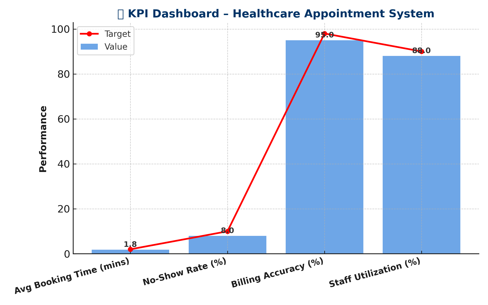
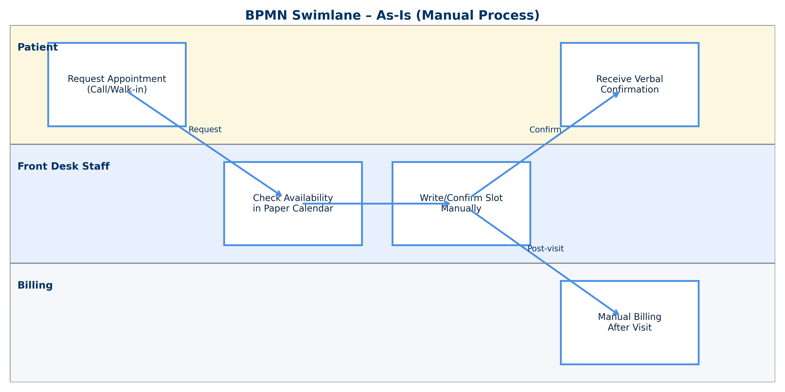
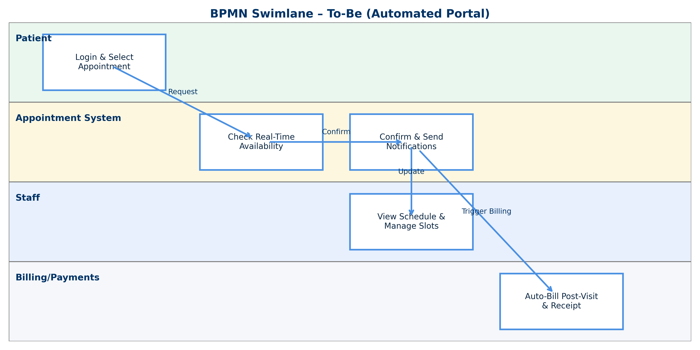
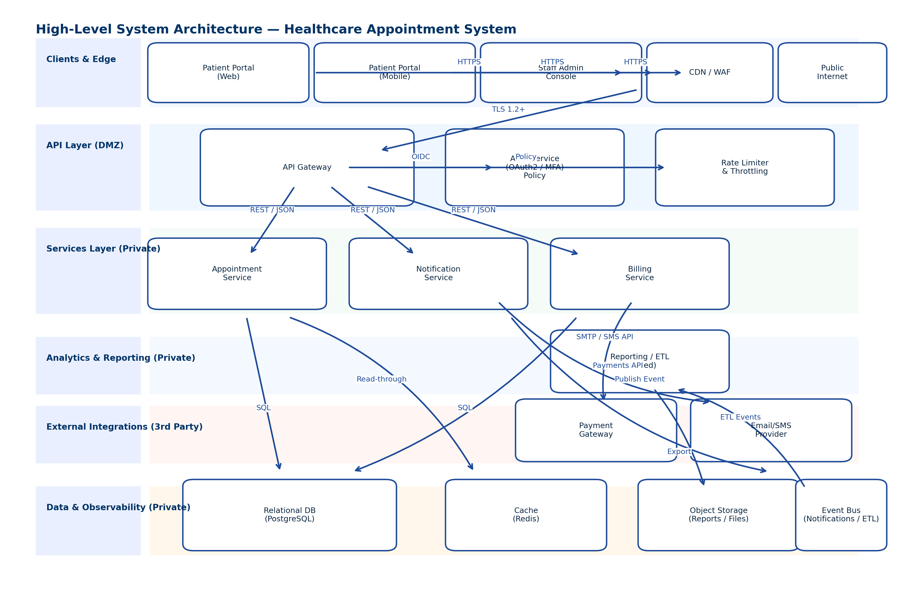
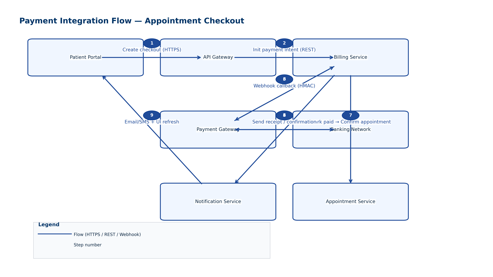

# 🖥️ Systems Analyst Portfolio — Jamie Christian

Recruiter-ready **Systems Analyst** portfolio for a **Healthcare Appointment System**, covering requirements (BRD/FRS/NFR), modeling (Context/DFD/UML/BPMN/ERD), testing (UAT plan/cases/feedback), governance (RTM/RACI/Risks/Changes), integrations, and KPI dashboard.

_Last updated: 2025-09-22_

---

## 🔎 Table of Contents
- [Quick Links](#-quick-links)
- [Mini Case Study (1-pager)](#mini-case-study-1pager)
- [Repository Structure](#repository-structure)
- [Folder Guide (What’s Where)](#folder-guide-whats-where)
- [Visual Preview](#visual-preview)
- [♻️ Reuse Templates](#️-reuse-templates)
- [🛠️ Tools & Skills](#️-tools--skills)
- [**ABOUT ME**](#about-me)
- [License](#license)

---

## 🔗 Quick Links
- BRD → `1_Requirements_Documentation/BRD_Healthcare_Appointment_System.docx`  
- FRS → `1_Requirements_Documentation/FRS_Healthcare_Appointment_System.docx`  
- **System Architecture** → `2_Process_Models_Diagrams/System_Architecture_Diagram.png`  
- **Payment Flow** → `2_Process_Models_Diagrams/Payment_Gateway_Integration_v2.png`  
- **KPI Dashboard (PNG)** → `7_Reports_Dashboards/KPI_Dashboard_Formatted.png`  
- **UAT (Filled)** → `5_Testing_UAT/UAT_Feedback_Form_Filled.docx`  
- **RTM** → `4_Traceability_Stakeholders/Requirements_Traceability_Matrix.xlsx`  
- **Case Study PDF** → `Healthcare_Appointment_Mini_Case_Study.pdf`

---

## Mini Case Study (1-pager)

**Problem → Objective → Outcome**  
Manual, phone-based scheduling created long waits and errors. We deployed an **online booking portal** integrated with **notifications** and **billing** to increase throughput and visibility. Outcomes: **booking time 1.8 min**, **no-show 8%**, **billing accuracy 95%**. :contentReference[oaicite:0]{index=0}

**KPIs (from production rollout mock)**

| KPI                         | Baseline | Target | Outcome | Status    |
|----------------------------|:--------:|:------:|:-------:|-----------|
| Average Booking Time (min) |   3.5    | ≤ 2.0  | **1.8** | On Track  |
| No-Show Rate (%)           |   12%    | < 10%  | **8%**  | On Track  |
| Billing Accuracy (%)       |   88%    | ≥ 98%  | **95%** | Improving |
| Staff Utilization (%)      |   75%    | ≥ 85%  | **88%** | On Track  |

**Artifacts supporting the case study**
- Requirements: **BRD / FRS / NFR**  
- Models: **Context/DFD**, **UML Use Case**, **ERD**, **BPMN As-Is/To-Be**  
- Integrations: **System Architecture** + **Payment Gateway Flow**  
- Quality: **UAT Plan**, **Test Cases**, **Defect Log**, **Filled Feedback**  
- Governance: **RTM**, **RACI**, **Stakeholder Map**, **Risk**, **Change Log**  
- Analytics: **KPI Dashboard**

> Open the full narrative: `Healthcare_Appointment_Mini_Case_Study.pdf`

---

## Repository Structure

# 🖥️ Systems Analyst Portfolio — Jamie Christian

Recruiter-ready **Systems Analyst** portfolio for a **Healthcare Appointment System**, covering requirements (BRD/FRS/NFR), modeling (Context/DFD/UML/BPMN/ERD), testing (UAT plan/cases/feedback), governance (RTM/RACI/Risks/Changes), integrations, and KPI dashboard.

_Last updated: 2025-09-22_

---

## 🔎 Table of Contents
- [Quick Links](#-quick-links)
- [Mini Case Study (1-pager)](#mini-case-study-1pager)
- [Repository Structure](#repository-structure)
- [Folder Guide (What’s Where)](#folder-guide-whats-where)
- [Visual Preview](#visual-preview)
- [♻️ Reuse Templates](#️-reuse-templates)
- [🛠️ Tools & Skills](#️-tools--skills)
- [**ABOUT ME**](#about-me)
- [License](#license)

---

## 🔗 Quick Links
- BRD → `1_Requirements_Documentation/BRD_Healthcare_Appointment_System.docx`  
- FRS → `1_Requirements_Documentation/FRS_Healthcare_Appointment_System.docx`  
- **System Architecture** → `2_Process_Models_Diagrams/System_Architecture_Diagram.png`  
- **Payment Flow** → `2_Process_Models_Diagrams/Payment_Gateway_Integration_v2.png`  
- **KPI Dashboard (PNG)** → `7_Reports_Dashboards/KPI_Dashboard_Formatted.png`  
- **UAT (Filled)** → `5_Testing_UAT/UAT_Feedback_Form_Filled.docx`  
- **RTM** → `4_Traceability_Stakeholders/Requirements_Traceability_Matrix.xlsx`  
- **Case Study PDF** → `Healthcare_Appointment_Mini_Case_Study.pdf`

---

## Mini Case Study (1-pager)

**Problem → Objective → Outcome**  
Manual, phone-based scheduling created long waits and errors. We deployed an **online booking portal** integrated with **notifications** and **billing** to increase throughput and visibility. Outcomes: **booking time 1.8 min**, **no-show 8%**, **billing accuracy 95%**. :contentReference[oaicite:0]{index=0}

**KPIs (from production rollout mock)**

| KPI                         | Baseline | Target | Outcome | Status    |
|----------------------------|:--------:|:------:|:-------:|-----------|
| Average Booking Time (min) |   3.5    | ≤ 2.0  | **1.8** | On Track  |
| No-Show Rate (%)           |   12%    | < 10%  | **8%**  | On Track  |
| Billing Accuracy (%)       |   88%    | ≥ 98%  | **95%** | Improving |
| Staff Utilization (%)      |   75%    | ≥ 85%  | **88%** | On Track  |

**Artifacts supporting the case study**
- Requirements: **BRD / FRS / NFR**  
- Models: **Context/DFD**, **UML Use Case**, **ERD**, **BPMN As-Is/To-Be**  
- Integrations: **System Architecture** + **Payment Gateway Flow**  
- Quality: **UAT Plan**, **Test Cases**, **Defect Log**, **Filled Feedback**  
- Governance: **RTM**, **RACI**, **Stakeholder Map**, **Risk**, **Change Log**  
- Analytics: **KPI Dashboard**

> Open the full narrative: `Healthcare_Appointment_Mini_Case_Study.pdf`

---

## Folder Guide (What’s Where)

| Folder | What’s inside | Skills Demonstrated |
|---|---|---|
| `1_Requirements_Documentation` | BRD, FRS, NFR | Elicitation, scoping, constraints, non-functional design |
| `2_Process_Models_Diagrams` | Context, DFD L1, UML Use Case, ERD, BPMN (As-Is/To-Be), Architecture, Payment Flow | Systems thinking, BPMN/UML/ER modeling, integration design |
| `3_User_Stories_Use_Cases` | Backlog, detailed use case | Agile analysis, acceptance criteria, scenario design |
| `4_Traceability_Stakeholders` | RTM, RACI, Stakeholder Map | Traceability, roles & responsibilities, stakeholder alignment |
| `5_Testing_UAT` | UAT plan, test cases, feedback (blank + filled), defect log | UAT planning, quality gates, sign-off evidence |
| `6_Governance_Data` | Data dictionary, risk register, change log | Data literacy, risk & change control |
| `7_Reports_Dashboards` | KPI Excel + PNG | Outcome orientation, BI handoff |

---

## Visual Preview

> PNGs render inline on GitHub for fast screening.

## Visual Preview

> PNGs render inline on GitHub for fast screening.

### KPI Dashboard

### BPMN — As-Is / To-Be

  
  

### Architecture & Payments

  
  

---

## **♻️ Reuse Templates**
- Duplicate any **.docx/.xlsx** artifact (BRD, RTM, UAT, Stakeholder Map, etc.).
- Export new diagrams from **Lucidchart** or **draw.io** as **PNG** for clean GitHub previews.
- Keep **folder names** consistent so links remain valid.

## **🛠️ Tools & Skills**
- **Docs:** Word, Excel  
- **Modeling:** Lucidchart / draw.io  
- **Data:** SQL (mock)  
- **BI:** Excel / Power BI (mock)  
- **Testing:** UAT templates & defect tracking  
- **Methods:** SDLC, BPMN, UML, Requirements Traceability

---

## **ABOUT ME**

**Jamie Christian** — **Systems Analyst**  
**LinkedIn:** [www.linkedin.com/in/jamiechristian2](https://www.linkedin.com/in/jamiechristian2)  
**Email:** [jamiechristian331@gmail.com](mailto:jamiechristian331@gmail.com)  
**Focus:** **Process improvement • Requirements & modeling • Data-driven decision support**

---

## License

MIT License — add a separate `LICENSE` file if you want GitHub to auto-detect the license.

