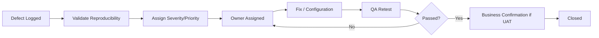

# Defect Triage Workflow

## Workflow

---

## Severity

| Severity | Definition | Target Response |
|---|---|---|
| Sev 1 | Critical service / patient-safety or major control failure; no workaround | Immediate triage |
| Sev 2 | Major workflow failure; limited workaround | Same business day |
| Sev 3 | Moderate defect; workaround available | Within 2 business days |
| Sev 4 | Cosmetic / minor usability | Planned backlog |

---

